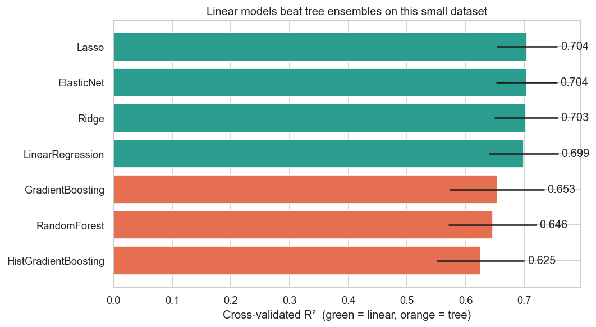
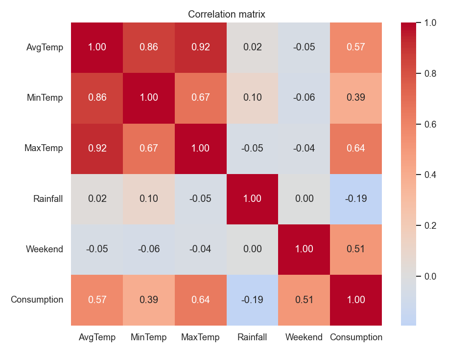

<div align="center">

# 🍺 Beer Consumption — São Paulo

**Predicting daily beer consumption from weather & calendar signals**


<sub>Kaggle: <a href="https://www.kaggle.com/datasets/dongeorge/beer-consumption-sao-paulo">Beer Consumption – São Paulo</a></sub>

</div>

---

## 📑 Contents

- [Overview](#overview)
- [Dataset](#-dataset)
- [Results](#-results)
- [Key Findings](#-key-findings)
- [Methodology](#-methodology)
- [Run it](#-run-it)
- [Repo structure](#-repo-structure)

---

## Overview

Predict **daily beer consumption (litres)** in a São Paulo university district from weather
and calendar signals. The dataset covers every day of **2015** (365 rows). The challenge:
train linear models (LinearRegression, Ridge, Lasso, ElasticNet), tune them, and find the best.

This project does that **honestly** — with proper cross-validation and **no target leakage** —
and benchmarks the linear models against tree ensembles to confirm the winner.

## 📦 Dataset

| Column | Meaning |
|---|---|
| `Avg / Min / Max Temp (°C)` | Daily temperatures |
| `Rainfall (mm)` | Daily precipitation |
| `Weekend` | 1 if Saturday/Sunday |
| **`Beer Consumption (L)`** | **Target** |

> 365 daily records · year 2015 · numbers stored with a decimal **comma** (`27,3`), fixed during cleaning.

## 📊 Results

**Lasso wins** with a 5-fold cross-validated **R² = 0.704 ± 0.052** (RMSE ≈ 2.34 L on a mean of ≈ 25 L).

| Model | CV R² | CV RMSE (L) |
|---|---|---|
| 🥇 **Lasso** | **0.704** | **2.34** |
| ElasticNet | 0.704 | 2.35 |
| Ridge | 0.703 | 2.35 |
| LinearRegression | 0.699 | 2.36 |
| GradientBoosting | 0.653 | 2.52 |
| RandomForest | 0.646 | 2.56 |
| HistGradientBoosting | 0.625 | 2.63 |



> On a held-out 20% test set the model scores **R² = 0.744, RMSE 2.38 L, MAE 1.99 L**.

## 🔑 Key Findings

1. **Temperature + weekend explain ~70% of the variance.** Max temperature (r ≈ 0.64) and the
   weekend flag (r ≈ 0.51) are the two dominant drivers; rain has a small negative effect
   (r ≈ -0.19). The remaining ~30% is day-specific event noise no weather/calendar model can recover.
2. **Linear regression is the *correct* model, not a fallback.** Tree ensembles score **lower**
   (~0.63–0.65) — with only 365 rows they overfit. Model complexity should match data size.
3. **Beware inflated scores.** A naïve notebook can report R² ≈ 0.77 on this data via
   **target leakage** (rolling means of the target leak the answer) or a **lucky split** (R²
   swings 0.58–0.79 across random seeds). This project uses 5-fold CV with no target-derived
   features — so the reported ~0.70 is trustworthy and reproducible.

## 🛠 Methodology

<details>
<summary><b>Click to expand the full pipeline</b></summary>

1. **Clean** — fix decimal-comma numbers, parse dates, drop trailing empty rows.
2. **EDA** — correlation analysis + scatter/box plots to find the real drivers.
3. **Leakage-free feature engineering** — temperature range, weekend×temperature interaction,
   rain flag, cyclical month encoding. **No target-derived features.**
4. **One fair protocol** — 5-fold cross-validation reporting R² and RMSE with fold-level
   standard deviation, applied identically to every model.
5. **Model comparison** — four linear models (tuned via `GridSearchCV`) vs. three tree
   ensembles; winner chosen on CV.
6. **Inspect the winner** — held-out evaluation, standardised-coefficient importance, residual plot.

### Feature correlations



</details>

## ▶️ Run it

```bash
pip install pandas numpy scikit-learn matplotlib seaborn jupyter
jupyter notebook beer_consumption_solution.ipynb
```

## 📁 Repo structure

| Path | Description |
|---|---|
| `beer_consumption_solution.ipynb` | **The solution** — full, reproducible analysis |
| `data/beer_consumption.csv` | Raw dataset |
| `data/model_comparison.png` | Model leaderboard chart (regenerated by the notebook) |
| `data/heatmap.png` | Feature correlation heatmap (regenerated by the notebook) |
| `optional_challenge1.ipynb` | Original first-pass notebook (kept for reference) |
| `docs/superpowers/` | Design spec & implementation plan |

---

<div align="center">
<sub>Built with scikit-learn · The honest answer beats the impressive-looking one.</sub>
</div>
